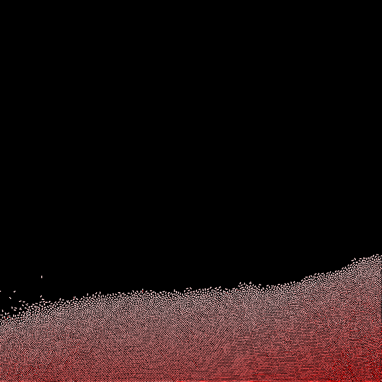
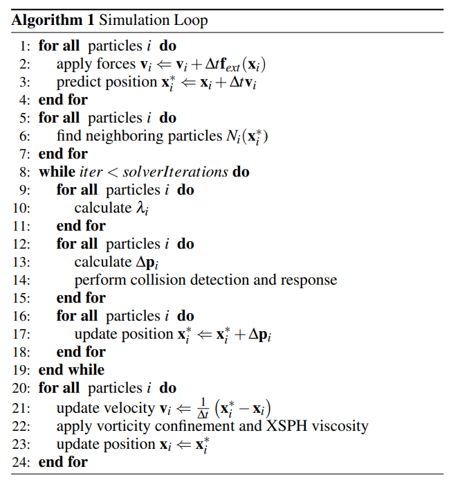
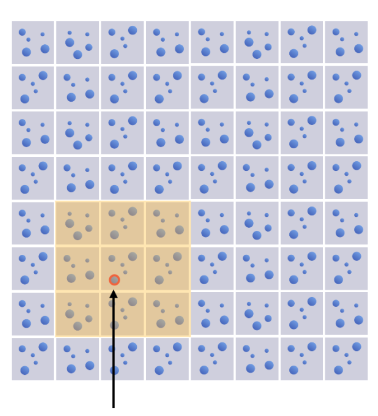
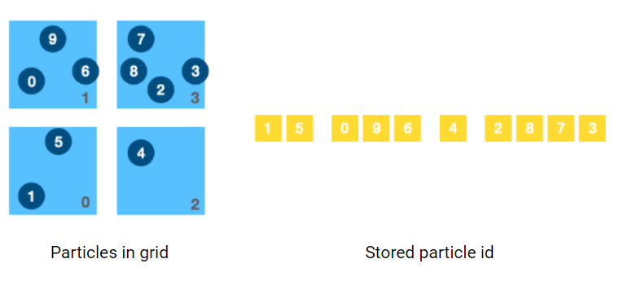

# High Performance PBD Fluids

This program is an implementation of [Position Based Fluids](https://mmacklin.com/pbf_sig_preprint.pdf).

Basic implementation on CPU, multi-thread programming, vectorization and CUDA acceleration is expected.

## Method

Position based fluids is a particle based simulation method. We start with a large number of particles as follows:

  

To focus on computational efficiency, we simulate these particles in $2D$ space.

Suppose there are $n$ particles. For each particle $i$, we store its position $\mathbf{x}_i$ and velocity $\mathbf{v}_i$ at time step $t$. The pressure $p_i$ at the position of particle $i$ will be computed, and inner force is generated from pressure. Based on inner forces, we update the state of each particle.

There are several steps in a single time step as shown here:

  

Implementation of CPU parallelization and SIMD vectorization can be designed for each part. Also, the whole algorithm can be applied on GPU by CUDA. 

### 1. Particle State Update

This step is simple:

$$\begin{align*}
\mathbf{v}_i&\Leftarrow \mathbf{v}_i + \Delta t \mathbf{f}_{ext}(\mathbf{x}_i)\\
\mathbf{x}_i&\Leftarrow\mathbf{x}_i+\Delta t \mathbf{v}_i
\end{align*}$$

- $\mathbf{x}_i$ and $\mathbf{v}_i$ is the position and velocity of particle $i$. 
- $\mathbf{f}_{ext}(\mathbf{x}_i)$ is the global external force at position $\mathbf{x}_i$ such as gravity. 
- $\mathbf{x}_{i}$ is the temporal predicted position to be modified in following steps.

**Baseline:** Iterate through all particles in single thread $\mathcal{O}(n)$ 

**Expected improvements:**

- [ ] CPU parallelization for each particle
- [ ] Vectorization: Update multiple particles at once
- [ ] GPU parallelization by CUDA

### 2. Neighbourhood Finding

For each particle, we need to find its neighboring partices $N_i(x_i)$ within a given range $r$. 

We can solve this by brute force that we check all pair of particles $\mathcal{O}(n^2)$. When we have more than $10K$ particles, it will cost infinite time.

**Baseline:** 
- Store all particles into a $m\times m$ hash grid
- Each cell of the hash grid represents $d\times d$ space$(d\geq2r)$
- Find neighboring particles in $3\times3$ grid cells

  

However, hash grid requires dynamic space allocation, which is time costing especially on GPU. 

If we store the hash grid in static array, it is easy to be parallelized but huge waste of store space.

**Expected improvements:**

We want to store number of particles in each cell, and index of those particles in compact 1d array, similar to Compressed Row(CSR) format.

  

- [ ] Improvement level 1:

- Count number of particles in each grid cell, store in 1d array `particle_count[m*m]`
- Create a 1d array `particle_in_grid[n]`
- Compute the start index of each grid cell, store in `prefix[m*m]`
- Insert particle index into `particle_in_grid[n]`

- [ ] Improvement level 2:

- Make steps in level 1 paralleled

### 3. Density estimation

For each particle $i$, we estimate the density $\rho_i$ at its positon $\mathbf{x}_i$ by:

$$\rho_i=\sum_j m_j W(\mathbf{x}_i-\mathbf{x}_j, h)$$

$W$ is a weight function based on distance and constant parameter $h$.

Denote the rest density as $\rho_0$, we have the constraints:

$$C_i(\mathbf{x}_1, \mathbf{x}_2, \dots, \mathbf{x}_n)=\frac{\rho_i}{\rho_0}-1$$

**Baseline:**

- Iterate through all particles

**Expected Improvements**:

- [ ] Paralleled for each particle
- [ ] Apply SIMD vectorization when computing density

### 4. Solve Constraints

A prarameter $\lambda_i$  is computed as:

$$\lambda_i=-\frac{C_i(\mathbf{x}_1, \mathbf{x}_2, \dots, \mathbf{x}_n)}{\sum_k \|\nabla_{\mathbf{x}_k}C_i\|+\varepsilon}$$

And then we update a correction of position:

$$\Delta \mathbf{x}_i=\frac{1}{\rho_0}\sum_j(\lambda_i+\lambda_j)\nabla W(\mathbf{x}_i-\mathbf{x}_j, h)$$

Finally, we add the corection to prediction:

$$\mathbf{x}_i=\mathbf{x}_i+\Delta\mathbf{x}_i$$

**Baseline:**

- Iterate through all particles

**Expected Improvements**:

- [ ] Paralleled for each particle
- [ ] Apply SIMD vectorization

### 5. Position Based Fluids on GPU

Finally, the implementation with CUDA is expected.

## Evaluation

- Accuracy: Average density in each time step(It should be as constant as possible)
- Total space cost
- Average time cost of each step 