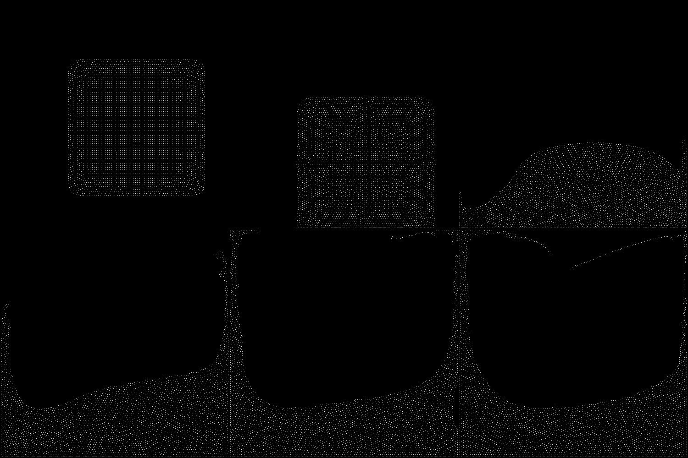
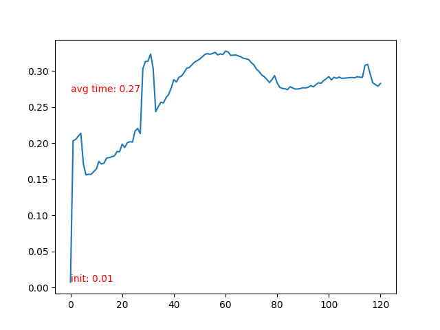
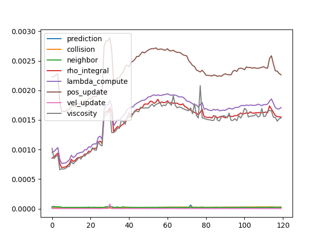
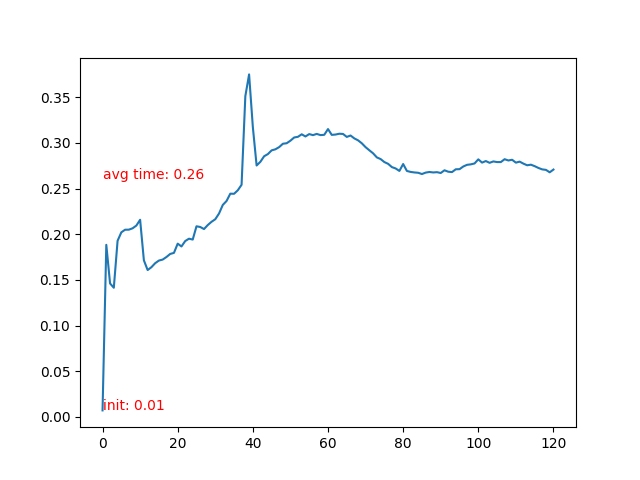
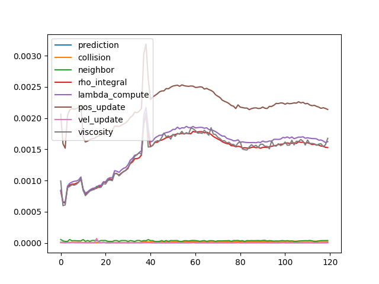
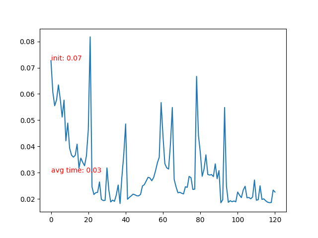

# High Performance Positon Based Fluids

## Introduction

This project is an implementation of [Position Based Fluids](https://mmacklin.com/pbf_sig_preprint.pdf), aiming at utilizing several techniques to improve the performance of simulation.

There are 4 versions included:

1. `pbf_baseline.cpp`: Single thread implementation
2. `pbf_simd.cpp`: Single thread implementation with SIMD vectorization
3. `pbf_omp.cpp`: Multi-thread implementation with SIMD vectorization
4. `pbf_cuda.cu`: CUDA implementation on GPU

What's special about thie repository:

- **Simplicity**: Only single file for each version of implementation.
- **Independency**: No external library required.

## Method

Position based fluids is a particle based simulation method. We start with a large number of particles as follows:

  

And we expect to simulate these particles as fluids.

Suppose there are $n$ particles. For each particle $i$, we store its position $\mathbf{x}_i$ and velocity $\mathbf{v}_i$ at time step $t$. The pressure $p_i$ at the position of particle $i$ will be computed, and inner force is generated from pressure. Based on inner forces, we update the state of each particle.

There are several steps in a single time step as shown here:

  

We summary the whole process of single simulation loop into these steps, following the order of execution in the simulation loop:

1. `prediction`: Apply forces and predict positions.
2. `collision`: Performe collision detection and response.
3. `neighbor`: Neighborhood finding of all particles.
4. `rho_integral`: Density integration of all particles.
5. `lambda_compute`: calculate $\lambda_i$ for each particle.
6. `pos_update`: Calculate $\Delta\mathbf{p}_i$ and apply to each particle.
7. `vel_update`: Update velocity $\mathbf{v}_i$.
8. `viscosity`: Apply viscosity confinement.

There are 8 steps in total, and we catogrize them into 3 types:

1. **Per-particle update**, including `prediction`, `collison` and `vel_update`. These steps are simple update of the state of each particle.
2. **Neighborhood update**, including `neighbor`. Neighborood finding is a hard-to-solve problem considering parallization and memory efficiency.
3. **Neighbor-based update**, update the state of each particle based on states of all neighborhood particles.  

### 1. Per-particle update
 
Steps of this type are fairly simple. For example:

$$\begin{align*}
\mathbf{v}_i&\Leftarrow \mathbf{v}_i + \Delta t \mathbf{f}_{ext}(\mathbf{x}_i)\\
\mathbf{x}_i&\Leftarrow\mathbf{x}_i+\Delta t \mathbf{v}_i
\end{align*}$$

- $\mathbf{x}_i$ and $\mathbf{v}_i$ is the position and velocity of particle $i$. 
- $\mathbf{f}_{ext}(\mathbf{x}_i)$ is the global external force at position $\mathbf{x}_i$ such as gravity. 
- $\mathbf{x}_{i}$ is the temporal predicted position to be modified in following steps.

The update of each particle is only related to its own state. 

**Baseline:** Iterate through all particles in single thread $\mathcal{O}(n)$ 

**Expected improvements:**

- [x] CPU parallelization for each particle
- [x] Vectorization: Update multiple particles at once
- [x] GPU parallelization by CUDA

### 2. Neighbourhood Update

For each particle, we need to find its neighboring partices $N_i(x_i)$ within a given range $r$. 

We can solve this by brutal force that we check all pair of particles $\mathcal{O}(n^2)$. When we have more than $1K$ particles, the time cost is already unacceptable.

**Baseline:** 
- Store all particles into a $m\times m$ hash grid
- Each cell of the hash grid represents $d\times d$ space $(d \geq 2r)$
- Find neighboring particles in $3\times3$ grid cells

  

However, hash grid requires dynamic space allocation, leading to unstable time cost of each frame. Also, dynamic memory allocation is way more complicated on GPU.

If we store the hash grid in static array, it is easy to be parallelized but huge waste of store space.

**Improved Method:**

We want to store number of particles in each cell, and index of those particles in compact 1d array, similar to Compressed Row(CSR) format.

  

1. First we iterate through all particles, count how many particles are included in each grid cell. The result is stored in 1d array `grid_particle_count[m*m]`. In the example shown in the figure, `grid_particle_count[4]=[2, 3, 1, 4]`. This step can be parallelized for each particle.
2. Add up all all the particle count in each column `column_particle_count[m]`. In the example it is `columm_particle_count[2]=[5, 5]`. This step can be parallelized for each grid cell.
3. Use a serialized loop to compute the prefix of each column. In the example it is `column_prefix[2]=[0, 5]`.
4. Set prefix of first grid cell of each column as column prefix. In the example it is `grid_prefix[4]=[0, null, 5, null]`.
5. Based on prefix of first cell of each column, we complete the whole prefix table. In the example it is `grid_prefix[4]=[0, 2, 5, 6]`. This step can be parallelized for each column.

- [x] Baseline:

- Single thread implementation of all steps.

- [x] Improvements:

- Parallization on CPU
- Parallization on GPU

### 3. Neighbor-Based Update

Steps in this section requires to iterate through all neighbors of each particle to update its state.

For example, for each particle $i$, we estimate the density $\rho_i$ at its positon $\mathbf{x}_i$ by:

$$\rho_i=\sum_j m_j W(\mathbf{x}_i-\mathbf{x}_j, h)$$

$W$ is a weight function based on distance and constant parameter $h$.

Denote the rest density as $\rho_0$, we have the constraints:

$$C_i(\mathbf{x}_1, \mathbf{x}_2, \dots, \mathbf{x}_n)=\frac{\rho_i}{\rho_0}-1$$

A prarameter $\lambda_i$  is computed as:

$$\lambda_i=-\frac{C_i(\mathbf{x}_1, \mathbf{x}_2, \dots, \mathbf{x}_n)}{\sum_k \|\nabla_{\mathbf{x}_k}C_i\|+\varepsilon}$$

And then we update a correction of position:

$$\Delta \mathbf{x}_i=\frac{1}{\rho_0}\sum_j(\lambda_i+\lambda_j)\nabla W(\mathbf{x}_i-\mathbf{x}_j, h)$$

Finally, we add the corection to prediction:

$$\mathbf{x}_i=\mathbf{x}_i+\Delta\mathbf{x}_i$$

**Baseline:**

- Iterate through all particles

**Expected Improvements**:

- [x] Parallization on CPU
- [x] Parallization on GPU

## Experiments and Results

CPU implementation is tested on a x86-64 CPU with 76 threads in total. SIMD vectorization is implemented with AVX512 vectorization extension.

GPU implementation is tested on nvidia A100 graphics card, cuda version 11.7.

We simulate 120 frames of the fluid animation. After each 20 frames we generate an image to make sure the simulation is propriate and stable. All the output images of each implementation is basically the same:

  

Based on the observation that the simulated animation is visually plausible, we evaluate each solver in several aspects:

1. Average density of each frame. The average density should be as stable as possible.
2. Maximum number of particles in grid cell. It should be as stable as possible.
3. Time cost of each frame.
4. Time cost of each step.

### 1. Baseline

  

    <figure>
    
    <figcaption style="text-align:center">Average density.</figcaption>
    </figure>
  

  

    <figure>
    
    <figcaption style="text-align:center">Max particle in cell</figcaption>
    </figure>
  

  

    <figure>
    
    <figcaption style="text-align:center">Time cost</figcaption>
    </figure>
  

  

    <figure>
    
    <figcaption style="text-align:center">Time cost of substeps</figcaption>
    </figure>
  

1. The average density rises after the particles collide with the bottom boundary, leading to compression and incresing of density.  
2. Max particles in cell is stable.
3. Time cost of each frame rises after the particle collidee with bottom boundary. More neighbor particles leads to slower iteration.
4. Detailed time log shows that **neighbor-based update** costs most of the time, and all other steps are relatively ignorable.

### 2. SIMD vectorization

The SIMD vectorization has been only applied to per-particle update substeps. Neighborhood related substeps has issues that the number of neighbor particles is indefinite, so the SIMD vectorization will only leads to worse performance. 

  

    <figure>
    
    <figcaption style="text-align:center">Average density.</figcaption>
    </figure>
  

  

    <figure>
    
    <figcaption style="text-align:center">Max particle in cell</figcaption>
    </figure>
  

  

    <figure>
    
    <figcaption style="text-align:center">Time cost</figcaption>
    </figure>
  

  

    <figure>
    
    <figcaption style="text-align:center">Time cost of substeps</figcaption>
    </figure>
  

The comparison of detailed time cost of per-particle update substeps will be shown in OMP section.

### 3. OMP Parallization

OMP parallization has been applied to all substeps. 

  

    <figure>
    
    <figcaption style="text-align:center">Average density.</figcaption>
    </figure>
  

  

    <figure>
    
    <figcaption style="text-align:center">Max particle in cell</figcaption>
    </figure>
  

  

    <figure>
    
    <figcaption style="text-align:center">Time cost</figcaption>
    </figure>
  

  

    <figure>
    
    <figcaption style="text-align:center">Time cost of substeps</figcaption>
    </figure>
  

The peak time cost on 20, 40 and 80 frames etc. is caused by rendering output images. The time cost of neighbor-related update subsetps have been decreased, but due to detailed observation, the time cost of per-particle update substeps **increased**. 

So another experiment has been performed, with omp threads limited to **16**. Time cost of the most simple per-particle update substeps are as follows:

| Solver     | Prediction | Position Update | Velocity Update |
| ---------- | :--------: | :-------------: | :-------------: |
| Baseline   |  1.98e-5   |     2.32e-4     |     2.45e-6     |
| SIMD       |  2.59e-6   |     2.19e-4     |     2.04e-6     |
| SIMD+omp   |  3.15e-4   |     2.30e-4     |     4.63e-5     |
| SIMD+omp16 |  5.20e-6   |     1.97e-4     |     6.04e-6     |

The result shows that when content of an iteration is simple, openmp with 76 threads make the performance worse. The time cost of arranging and launching of those threads cost too much time. If we decrease the number of threads to 16, the performance can exceed the baseline. However, the best performance is achieved by SIMD single thread execution.

### 4. CUDA

  

    <figure>
    
    <figcaption style="text-align:center">Average density.</figcaption>
    </figure>
  

  

    <figure>
    
    <figcaption style="text-align:center">Time cost</figcaption>
    </figure>
  

CUDA implementation is only evaluated by average density and time cost of each frame, since it will be definitely faster than any other implementation. Implementation of this part took most of the time of this project, with a high performance solver as pay back.

## Conclusion

This project has summarized 3 performance optimization techniques, CPU parallization, SIMD vectorization and CUDA on a physics simulation solver. 

Position based fluids cannot handle massive number of particles more than 10K, and I believe that when number of particles is much larger, CPU parallization will definitely bring improvements. The most inspiring lesson from this project is the fact that CPU parallization might make it worse when you have a simple serialized loop, and more CPU threads can make the solver unstable. 

For implementation on CPU, the best choice is applying SIMD vectorization as much as possible, and only parallize the loops that each iteration is complicated. For implementation on CUDA, utilizing tools such as cuda-memcheck and cuda-gdb are much helpful.

